# 1. Create Project

## 1.1 Creating GitHub Repository

### **Creating the (Private) GitHub Repository**

This section of the guide provides standard instructions for creating a Private [Github](https://github.com/) Repository. Before proceeding, please ensure all the [requirements](required.md) are met and [Security Authentications](https://docs.github.com/en/authentication/managing-commit-signature-verification/about-commit-signature-verification) are setup in [Git](https://git-scm.com/downloads). These instructions were created for and by the Software Development department of [Blue Coconut Multimedia Solutions Limited](https://bluecoconut.ltd) using the [GitHub/bluecoconutltd](https://github.com/bluecoconutltd) repositories.

* **1.1.1** - In the upper-right corner of any page on [Github](https://github.com/), select the ++plus++:material-cursor-default: icon and use the drop-down menu, and select ++"New Repository"++:material-cursor-default:.  
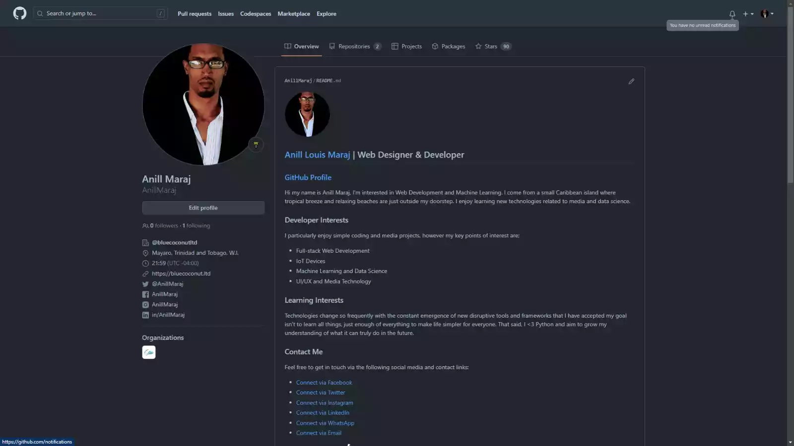{ width="600" title="click to enlarge"}

* **1.1.2** - Type the [Project Name] and add a description of the Repository eg: "Blue Coconut Multimedia Solutions Limited Software Developer Guidelines".

* **1.1.3** - Set the repository visibility to :octicons-lock-24:++"Private"++:material-cursor-default: and **check**:material-menu-right::material-checkbox-marked: Initialize this Repository with a **README.md** file, then choose ++"MIT License"++:material-cursor-default: and Click ++"Create repository"++:material-cursor-default:.  
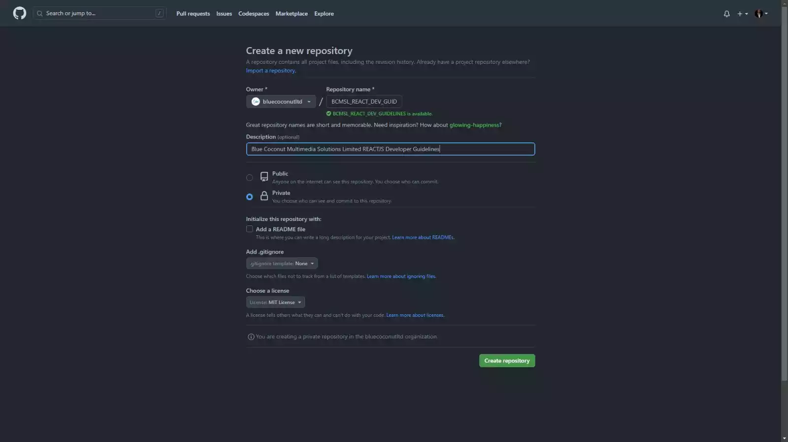{ width="600" title="click to enlarge"}

* **1.1.4** - Assigned Members should now be able to view the :octicons-lock-24: **Private** [Github](https://github.com/) repository.  
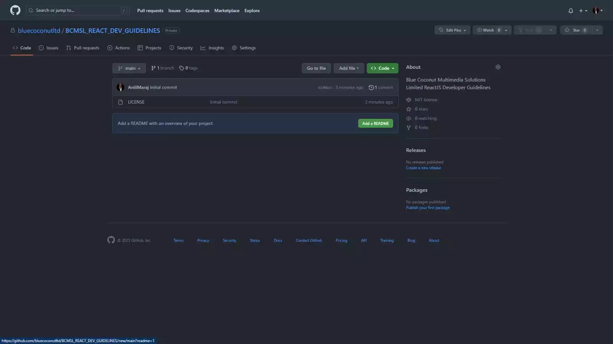{ width="600" title="click to enlarge"}

***

## 1.2 Setting Up Documentation

### **Creating the Project Folder (with Documentation)**

The method described below allows for a clean professional setup of a development workspace with the use of proper documentation for clients. Please ensure the [Requirements](required.md) are met before proceeding since it assists the developer(s) it completing the proceeding steps.

* **1.2.1** - **Right-click** in the :material-folder:`APP_DEV/BCMSL_REACT_PROJECTS` folder and click ++"Open with Code"++:material-cursor-default: to open the folder in the :material-microsoft-visual-studio-code:[Visual Studio Code](https://code.visualstudio.com/) IDE application.  
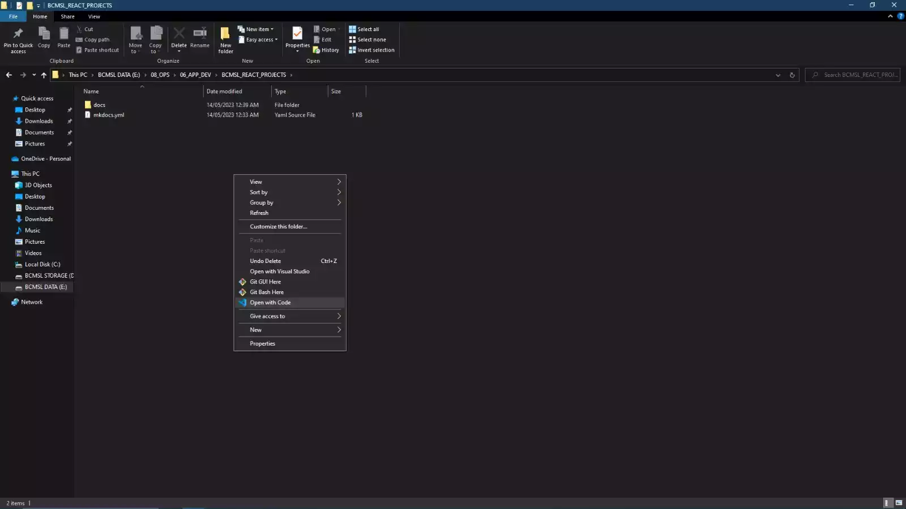{ width="600" title="click to enlarge"}

* **1.2.2** - Once :material-microsoft-visual-studio-code:[Visual Studio Code](https://code.visualstudio.com/) is properly opened, please sign-in with your :material-github:[Github](https://github.com/) Account, then go to **Terminal > New Terminal** or press ++ctrl+shift+grave++ to launch a New Terminal ( :simple-windowsterminal: CMD or :material-powershell: PowerShell ).  
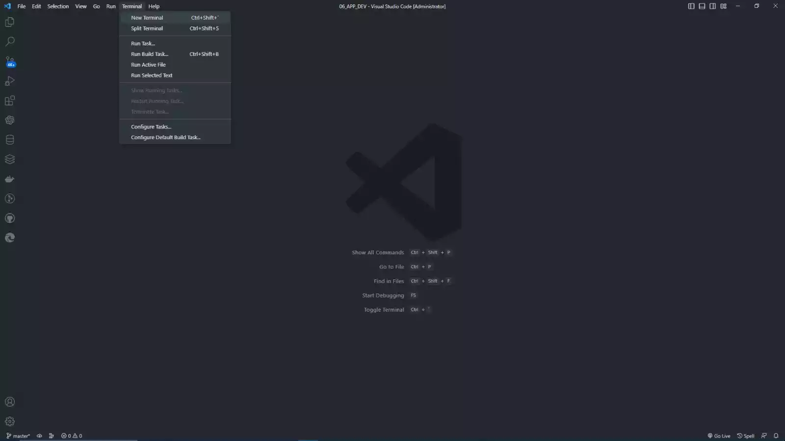{ width="600" title="click to enlarge"}  

!!! note-github "Alternative Option: Using Repository Template"
    Sign into :material-microsoft-visual-studio-code: [Visual Studio Code](https://code.visualstudio.com/) using :material-github: [Github](https://github.com/) Account and Turn on Settings Sync,  
  
    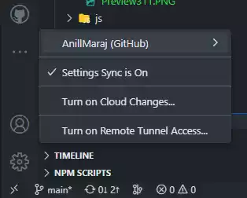{ width="300" title="click to enlarge"}  

    then go to the [Github Repository](https://github.com/bluecoconutltd) and click the ++"Use this template"++:material-cursor-default: button  
    
    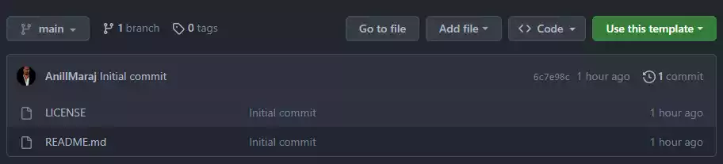{ width="600" title="click to enlarge"}  
    or use **any** of the options under the ++"<Code>"++:material-cursor-default: button.  

    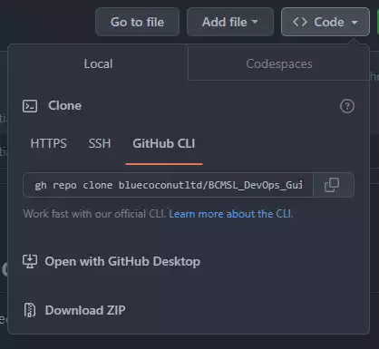{ width="300" title="click to enlarge"}  
  
* **1.2.3** - Next, install [MkDocs](https://www.mkdocs.org/getting-started/#theming-our-documentation) by running **`pip install mkdocs`** from the command line in the :material-powershell: PowerShell Terminal.

!!! note "Install the Following Dependencies!"

    * [Material for MkDocs](https://squidfunk.github.io/mkdocs-material/) - a theme for MkDocs
    ```pip
    pip install mkdocs-material
    ```
    * [YAML VS Code Extension](https://marketplace.visualstudio.com/items?itemName=redhat.vscode-yaml) - a verified :material-microsoft-visual-studio-code:[Visual Studio Code](https://code.visualstudio.com/) Extension for YAML Language support
    ```powershell
    code --install-extension redhat.vscode-yaml
    ```
    * Add the following [Material for MkDocs](https://squidfunk.github.io/mkdocs-material/) [YAML](https://marketplace.visualstudio.com/items?itemName=redhat.vscode-yaml) schema to the user :material-file:`settings.json` file in [Visual Studio Code](https://code.visualstudio.com/).  
    Go to File > Preferences > Settings or press ++ctrl+shift+p++ then type >`settings.json` and select `Preferences: Open User Settings (JSON)`.

    ```json title="settings.json"
        "yaml.schemas": {
          "https://squidfunk.github.io/mkdocs-material/schema.json": "mkdocs.yml"
        },
        "yaml.customTags": [ 
      
      
          "!ENV scalar",
          "!ENV sequence",
          "tag:yaml.org,2002:python/name:materialx.emoji.to_svg",
          "tag:yaml.org,2002:python/name:materialx.emoji.twemoji",
          "tag:yaml.org,2002:python/name:pymdownx.superfences.fence_code_format"
        ]
    ```

    * [Mike](https://github.com/jimporter/mike) - a Python utility that makes it easy to deploy multiple versions of the document to a Git branch.
    ```pip
    pip install mike
    ```
    * [git-revision-date-localized](https://github.com/timvink/mkdocs-git-revision-date-localized-plugin) - a plugin that supports adding the date of last update and creation of a document at the bottom of each page.
    ```pip
    pip install mkdocs-git-revision-date-localized-plugin
    ```
    * [git-committers](https://github.com/ojacques/mkdocs-git-committers-plugin-2) - a plugin that renders the GitHub avatars of all contributors, linking to their GitHub profiles at the bottom of each page.
    ```pip
    pip install mkdocs-git-committers-plugin-2
    ```
    * [git-authors](https://github.com/timvink/mkdocs-git-authors-plugin/) - a plugin extracts the authors of a document from git to display them at the bottom of each page. It's a lightweight alternative to the git-committers plugin.
    ```pip
    pip install mkdocs-git-authors-plugin
    ```
    * [MkDocs GLightbox](https://github.com/blueswen/mkdocs-glightbox) - a [MkDocs](https://www.mkdocs.org/getting-started/#theming-our-documentation) plugin that supports image lightbox with GLightbox.
    ```pip
    pip install mkdocs-glightbox
    ```
    * [LXML Parser](https://lxml.de/parsing.html) - a very simple and powerful API for parsing XML and HTML that supports one-step parsing as well as step-by-step parsing using an event-driven API.
    ```pip
    pip install lxml
    ```
    * [Cairo Graphics](https://lxml.de/parsing.html) - a graphics library and dependency of Pillow, which Material for MkDocs makes use of for generating social cards and performing image optimization.
    ```pip
    pip install pillow cairosvg
    ```
    * [MkDocs Table Reader](https://timvink.github.io/mkdocs-table-reader-plugin/) - a  import data from a CSV or Excel file for data tables:
    ```pip
    pip install mkdocs-table-reader-plugin
    ```

* **1.2.4** - In the :material-powershell:PowerShell Terminal run the following command **`mkdocs new [dir-name]`** replacing `[dir-name]` with the project folder name.  
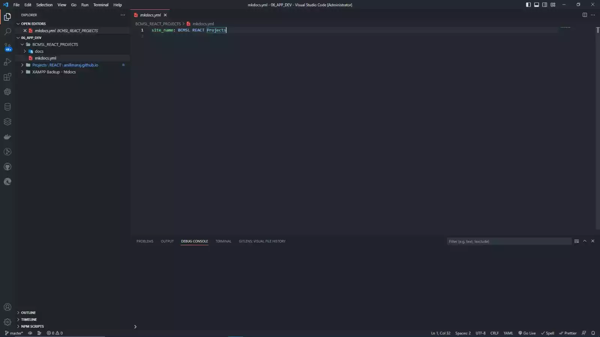{ width="600" title="click to enlarge"}

* **1.2.5** - Open the created `mkdocs.yml` file and rename the `site_name: My Docs` to `site_name: BCMSL_[Project Name]` replacing `[Project Name]` with the assigned project's name e.g: *BCMSL_Admin_App*.
  
## 1.3 Creating React App

### **Create React App (using ViteJS)**

* **1.3.1** - Ensure :material-nodejs:[NodeJS](https://nodejs.org/en/download) and :material-npm:[NPM](https://docs.npmjs.com/downloading-and-installing-node-js-and-npm) are installed by running the following commands in the :material-powershell:PowerShell Terminal **`node -v`** and **`npm -v`** one after the other. ***Please carefully observe the NPM version***.

* **1.3.2a** - To create a React app using **:simple-vite:[Vite](https://vitejs.dev/guide/#scaffolding-your-first-vite-project) *with :material-npm:[NPM](https://docs.npmjs.com/downloading-and-installing-node-js-and-npm) version 6.X*** :  
   Run the following command in the :material-powershell:PowerShell Terminal **`npm create vite@latest BCMSL_[Project Name] --template react`** replacing `[Project Name]` with the project's name.  
   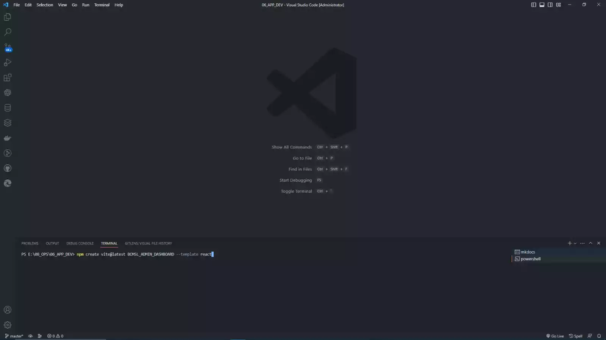{ width="600" title="click to enlarge"}

* **1.3.2b** - To create a React app using **:simple-vite:[Vite](https://vitejs.dev/guide/#scaffolding-your-first-vite-project) *with :material-npm:[NPM](https://docs.npmjs.com/downloading-and-installing-node-js-and-npm) version +7.X***  :  
   Run the following command in the :material-powershell:PowerShell Terminal **`npm create vite@latest BCMSL_[Project Name] -- --template react`** replacing **`[Project Name]`** with the project's name.  
   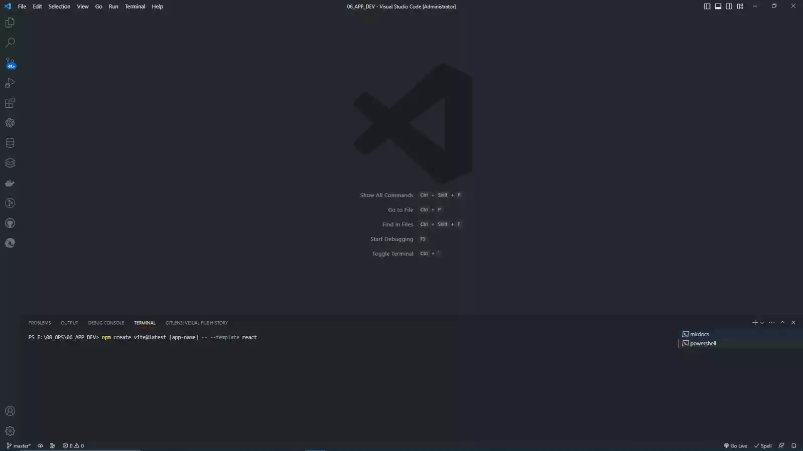{ width="600" title="click to enlarge"}

* **1.3.3** - In the :material-powershell:PowerShell Terminal you may be prompted to **install [Vite](https://vitejs.dev/guide/#scaffolding-your-first-vite-project)** simply type **`'y'`** and press ++enter++ to accept or run the following command **`npm i vite`**.

* **1.3.4** - You will be prompted to choose your framework template, select **:material-react:`React`**, then choose your template variant language, select **:material-language-javascript:`JavaScript`** and continue installation.  
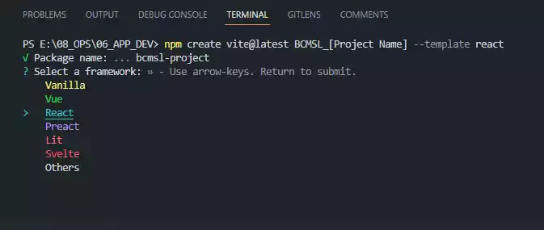{title="click to enlarge"}  
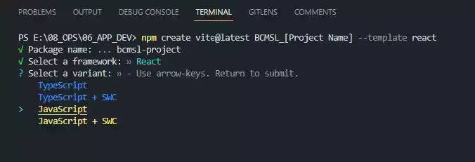{title="click to enlarge"}  

!!! info inline end "Note: CLI Terminal Usage"

    These images are basic examples. Both **:simple-windowsterminal: CMD** or **:material-powershell:PowerShell** Terminals would produce the same outputs or trigger the necessary terminal when running commands. Unless explicitly advised in certain instances, the developer would be required to manually switch to a specific CLI to run some commands. Example: Using :material-git:Git Bash for Unix-like Commands.
  
***

* **1.3.5** - After the project folder is created by [MkDocs](https://www.mkdocs.org/getting-started/#theming-our-documentation), run **`cd [dir-name]`** replacing `[dir-name]` with the project folder name to navigate to the project folder in the :material-powershell:PowerShell Terminal.

* **1.3.6** - In the :material-powershell:PowerShell Terminal run **`npm install`** to install the :simple-vite:[Vite](https://vitejs.dev/guide/#scaffolding-your-first-vite-project)+[React](https://react.dev/learn) packages and file system.  

***
!!! note-license inline "License Notice"
  
    [Blue Coconut Multimedia Solutions Limited](https://bluecoconut.ltd)  
    52A Eccles Road, Grand Lagoon,  
    Mayaro, Trinidad and Tobago, W.I.  
    <info@bluecoconut.ltd>  
    --------------------------
    All Rights Reserved under the:  
    [MIT License (2023)](license.md)  
    { width="50px" } { width="50px" }
