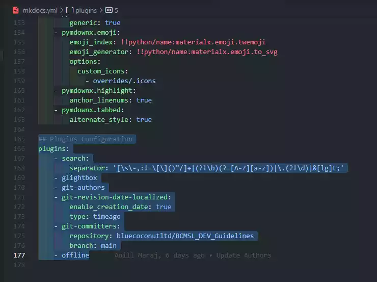

# 3. Modify Project

## 3.1 Updating MkDocs Configuration

### **Updating the mkdocs.yaml file**

After successfully [Creating the Project Template](create.md), this step guides the developer to begin customizing the documentation template with relevant configurations data.

* **3.1.1** - Add or Uncomment the following plugins in the :material-file:`mkdocs.yaml` file in the root directory by pressing ++ctrl+slash++ and save the changes.

```yaml title="mkdocs.yaml" linenums="166"
plugins:
    - search:
        separator: '[\s\-,:!=\[\]()"/]+|(?!\b)(?=[A-Z][a-z])|\.(?!\d)|&[lg]t;'
    - glightbox
    - git-authors
    - git-revision-date-localized:
        enable_creation_date: true
        type: timeago
    - git-committers:
        repository: bluecoconutltd/BCMSL_[Project Name]
        branch: main
    - offline

```

!!! info "Important Reminder!"
    Please **rename** the `site_name: BCMSL_[Project Name]` replacing `[Project Name]` with the assigned project's name.
  
{ width="600" title="click to enlarge"}

## 3.2 Updating Template Data

### **Updating the ViteJS+React & MkDocs Favicons and Template Data**

* **3.2.1** - In the `docs` folder create an `assets` folder containing an `img`, `css` and `js` folder and copy the `favicon.ico` file into the `img` folder.

* **3.2.2** - Replace the `favicon.svg` file in the root project directory.

* **3.2.3** - Edit `index.html` and `App.js` files in the root project directory.  

* **3.2.4** - :material-git: `Commit and Push` the Project Folder to the assigned BCMSL_[Project Name] :material-github: [Github](https://github.com/) repository using.

!!! warning "VERY IMPORTANT REMINDER !!"
    Please leave **CLEAR & READABLE** commit messages when pushing changes to any BCMSL :material-github: [Github](https://github.com/) repository.  

***
!!! note-license inline "License Notice"
    [Blue Coconut Multimedia Solutions Limited](https://bluecoconut.ltd)  
    52A Eccles Road, Grand Lagoon,  
    Mayaro, Trinidad and Tobago, W.I.  
    <info@bluecoconut.ltd>  
    --------------------------
    All Rights Reserved under the:  
    [MIT License (2023)](license.md)  
    { width="50px" } { width="50px" }
