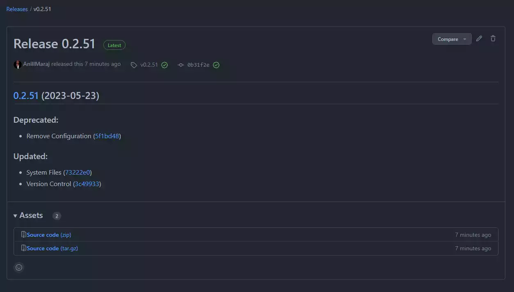
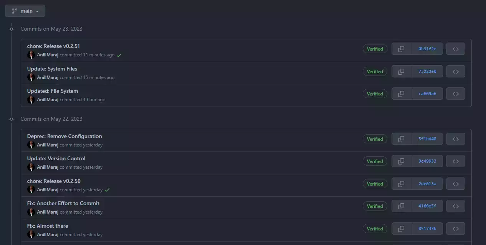

# Requirements

## **BCMSL DevOps Basic Requirements**

Developers are required to have the **minimum** services, software and hardware prepared **before** initiating any [Blue Coconut Multimedia Solutions Limited](https://bluecoconut.ltd) software development projects.
  
## **0.1 Services**

**Project Developers must have access to the following services:**

* A Verified :fontawesome-solid-user-tie: [BCMSL Employee](https://crm.bluecoconut.ltd/admin) Account.
* A Verified :material-github: [Github](https://github.com/) Account (GPG or SSH Secured).
* A Verified :simple-gnuprivacyguard: [GNU Privacy Guard](https://www.gnupg.org/ftp/gcrypt/binary/gnupg-w32-2.4.1_20230428.exe) CLI and Security Key.  
!!! note-github "[GitHub](https://docs.github.com/) Reference: **Signature Verification**"
    *Read either the adding [GPG](https://docs.github.com/en/authentication/managing-commit-signature-verification/adding-a-gpg-key-to-your-github-account) or [SSH](https://docs.github.com/en/authentication/connecting-to-github-with-ssh/adding-a-new-ssh-key-to-your-github-account?platform=linux&tool=webui) instructions for more information.*  
    **:material-alert: ALL GitHub Push Requests (Releases, Tags and Commits) MUST be verified by developer!**  

    **Example of Verified Releases :octicons-verified-16: :**  
    { width="600" title="click to enlarge"}  

    **Example of Verified Commits :octicons-verified-16: :**  
    { width="600" title="click to enlarge"}  

    **Example of Verified Tags :octicons-verified-16: :**  
    { width="600" title="click to enlarge"}  

***

## **0.2 Software**

**Project Developers must have the following software:**

* Installed :material-microsoft-visual-studio-code: [Visual Studio Code](https://code.visualstudio.com/) IDE application.

* Installed :material-git: [Git](https://git-scm.com/downloads) version control system.

* Installed :material-nodejs: [NodeJS version 12.2.0 or higher](https://nodejs.org/en/download) server environment.

* Installed :material-npm: [NPM](https://docs.npmjs.com/downloading-and-installing-node-js-and-npm) if not packaged with NodeJS.

* Installed :material-language-python: [Python](https://www.python.org/downloads/) programming language.

* Installed :material-github: [GitHub Desktop](https://desktop.github.com/) local CI (Continuous Integration) system.

***

## **0.3 Hardware**

**Project Developers must have the following hardware:**

* :octicons-cpu-16: Minimum of ARM64 or x64 Processor; Quad-core or above.
* :fontawesome-solid-memory: Minimum of 2 vCPU and 8 GB RAM / 4 vCPU and 16 GB of RAM.
* :fontawesome-solid-hard-drive: Minimum of 850 MB to 210 GB of available Hard disk space.
* :fontawesome-solid-display: Minimum of WXGA (1366 by 768) Video card display resolution.

***
!!! note-license inline "License Notice"
  
    [Blue Coconut Multimedia Solutions Limited](https://bluecoconut.ltd)  
    52A Eccles Road, Grand Lagoon,  
    Mayaro, Trinidad and Tobago, W.I.  
    <info@bluecoconut.ltd>  
    --------------------------
    All Rights Reserved under:  
    [MIT License (2023)](license.md)  
    { width="50px" } { width="50px" }
