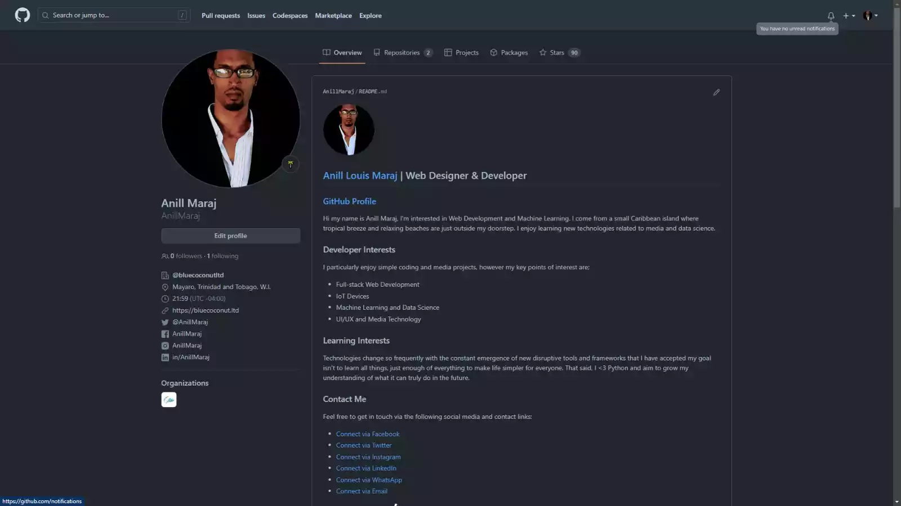
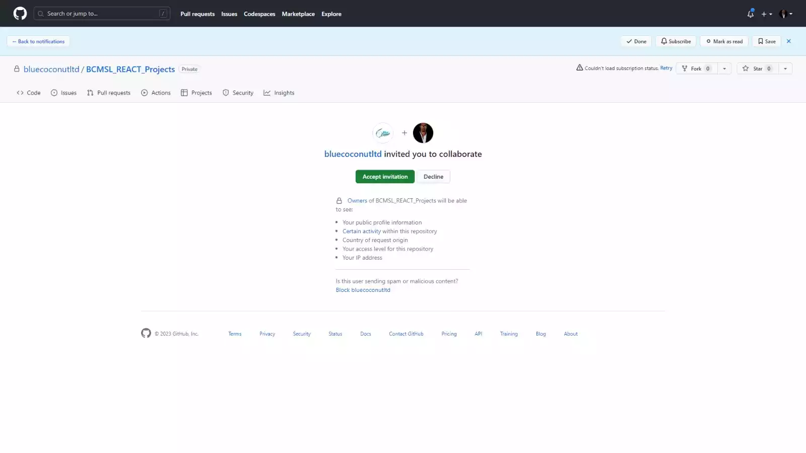
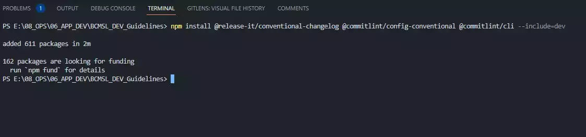
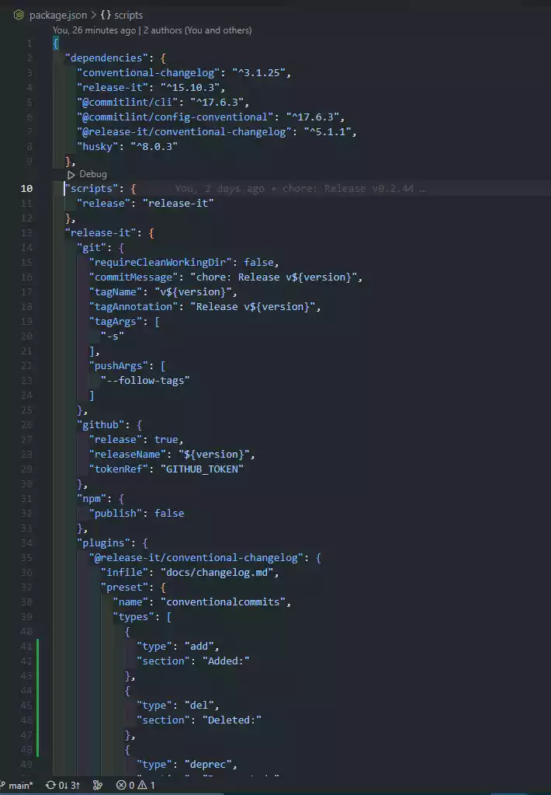
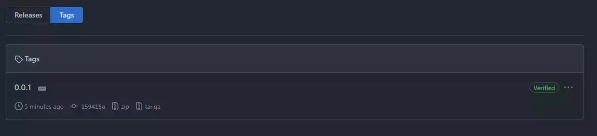
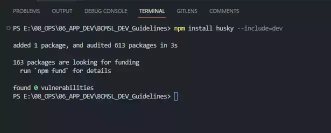
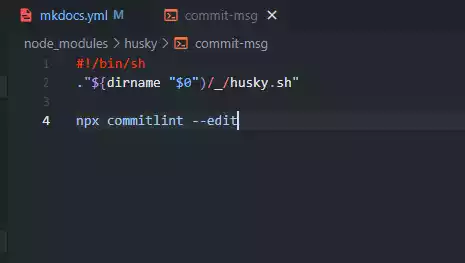
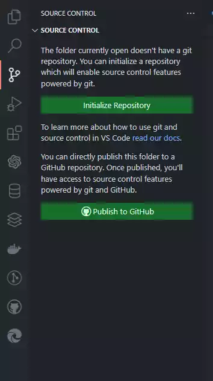
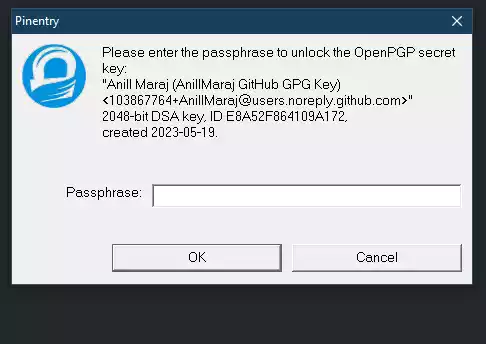
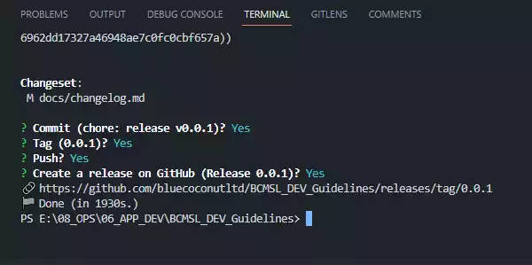

# 2. Version Control

## 2.1 Working with GitHub

### **Accessing the (Private) GitHub Repository**

After successfully [Creating the Project Template](create.md), the lead developer at [Blue Coconut Multimedia Solutions Limited](https://bluecoconut.ltd) would in most instances create and provide a private [Github](https://github.com/) Repository to work from. In this step we continue by accessing the repository, then setting up an automatically updating changelog.

* **2.1.1** - Login to [Github](https://github.com/) and navigate the cursor to the upper-right corner of any page and click the :octicons-bell-16: notification icon to open the notifications page.  
{ width="600" title="click to enlarge"}

* **2.1.2** - Select the Collaborator Request in the notifications list and click ++"Accept Invitation"++:material-cursor-default: to view the assigned [Github](https://github.com/) repository.  
{ width="600" title="click to enlarge"}

* **2.1.3** - Please follow the Rules and Policies of the repository to avoid any issues.
  
!!! warning "**IMPORTANT NOTE: Developers require an Authenticated [Github](https://github.com/) Account and  Repository!**"

      * Click **[HERE](create.md)** and Follow these steps if **NO** [Github](https://github.com/) repository exists!

      * **All GitHub Push Requests (Releases, Tags and Commits) MUST be verified!**

***

## 2.2 Updating Git Configuration

### **Updating the .gitignore file**

* **2.2.1** - To prevent uploading the documentation builds and the files contained inside it to the repository, add `/site` to your :material-file:`.gitignore` file in the root directory of your project or simply run this command in the :material-git: `Git Bash` Terminal:  

      ```bash
  
      echo "site/" >> .gitignore  
  
      ```

***

## 2.3 Creating Changelog

### **Create Changelog using Release\-It & CommitLint**

* **2.3.1** - In the :material-powershell: PowerShell Terminal install [Release-It](https://www.npmjs.com/package/release-it) by running:

      ```powershell
  
      npm init release-it  
  
      ```

      * Then run the following command in the :material-powershell: PowerShell Terminal to install the [Conventional Changelog for Release-It](https://github.com/release-it/conventional-changelog) and [CommitLint](https://www.npmjs.com/package/commitlint) plugins:

      ```powershell
  
      npm install @release-it/conventional-changelog @commitlint/config-conventional @commitlint/cli --include=dev 
  
      ```

      { width="600" title="click to enlarge"}

* **2.3.2** - Add the following configuration for [Release-It](https://www.npmjs.com/package/release-it) in the :material-file:`package.json` file:

      ```json title="package.json" linenums="7"
      "scripts": {
        "release": "release-it"
      },
      "release-it": {
        "git": {
          "requireCleanWorkingDir": false,
          "commitMessage": "chore: Release v${version}",
          "tagName": "v${version}",
          "tagAnnotation": "Release v${version}",
          "tagArgs": [
            "-s"
          ],
          "pushArgs": [
            "--follow-tags"
          ]
        },
        "github": {
          "release": true,
          "releaseName": "Release ${version}",
          "tokenRef": "GITHUB_TOKEN"
        },
        "npm": {
          "publish": false
        },
        "plugins": {
          "@release-it/conventional-changelog": {
            "infile": "docs/changelog.md",
            "preset": {
              "name": "conventionalcommits",
              "types": [
                {
              "type": "add",
              "section": "Added:"
                },
                {
                  "type": "del",
                  "section": "Deleted:"
                },
                {
                  "type": "deprec",
                  "section": "Deprecated:"
                },
                {
                  "type": "docs",
                  "section": "Documentation:"
                },
                {
                  "type": "feat",
                  "section": "Features:"
                },
                {
                  "type": "fix",
                  "section": "Bug Fixes:"
                },
                {
                  "type": "int",
                  "section": "Integrated:"
                },
                {
                  "type": "renamed",
                  "section": "Renamed:"
                },
                {
                  "type": "roll",
                  "section": "Rollback:"
                },
                {
                  "type": "refactor",
                  "section": "Refactored:"
                },
                {
                  "type": "update",
                  "section": "Updated:"
                },
                {}
              ]
            }
          }
        }
      },
      ```
      { width="600" title="click to enlarge"}

!!! note-github "[GitHub](https://github.com/) Reference: Review Source Code Application:"
    *Visit the [codityco - GitHub Repository](https://github.com/codityco/001-add-a-changelog-to-any-project/blob/develop/package.json#L27) to view configuration of :material-file:`package.json` file.*  

* **2.3.3** - Take a note of the `"tagArgs": ["-s"]` in the :material-file:`package.json` file, this is mandatory for pushing singed tags to [BCMSL GitHub](https://github.com/bluecoconutltd) repositories making them **verified**:  
{ width="600" title="click to enlarge"}  

* **2.3.4** - Install [Husky](https://www.npmjs.com/package/husky) from the :material-powershell: PowerShell Terminal by running the command:

      ```powershell
  
      npm install husky --include=dev 
  
      ```
      { width="600" title="click to enlarge"}

* **2.3.5** - To add the the hooks that will allow the developer to run commands based off [Git Actions](https://docs.github.com/en/actions), initialize a scheme by running the the following command from the :material-powershell: PowerShell Terminal:

      ```powershell
  
      ./node_modules/husky/lib/bin.js install 
  
      ```

* **2.3.6** - Create a :material-file:`commit-msg` file in the :material-folder:`node_modules/husky` folder then run the following in :material-git: Git Bash Terminal:

      ```bash
  
      touch node_modules/husky/commit-msg && chmod a+x node_modules/husky/commit-msg 
  
      ```

* **2.3.7** - Proceed to add the following to the :material-file:`commit-msg` file.
  
      ```bash title="commit-msg" linenums="1"
      #!/bin/sh
      ."${dirname "$0")/_/husky.sh"

      npx commitlint --edit
      ```
      The above allows [Husky](https://www.npmjs.com/package/husky) to run [CommitLint](https://www.npmjs.com/package/commitlint) so it can check the commit messages and run on the commit command.  
      { width="400" title="click to enlarge"}

* **2.3.8** - Create a :material-file:`changelog.md` file in the :material-folder:`docs` folder and enter the following information:
  
      ```markdown title="changelog.md" linenums="1"
        # [**:material-github::material-file-document-alert-outline:**](https://github.com/bluecoconutltd/BCMSL_DEV_Guidelines/blob/main/docs/changelog.md)

        ***

        ## **:material-menu-up-outline:**

        ### **CHANGELOG :material-text-long:**

        #### [Verified Release :octicons-verified-16:](https://github.com/bluecoconutltd/BCMSL_DEV_Guidelines/tags)

        !!! note-license inline "License Notice"

            [Blue Coconut Multimedia Solutions Limited](https://bluecoconut.ltd)  
            52A Eccles Road, Grand Lagoon,  
            Mayaro, Trinidad and Tobago, W.I.  
            <info@bluecoconut.ltd>  
            --------------------------
            All Rights Reserved under the:  
            [MIT License (2023)](license.md)  
            { width="50px" } { width="50px" }
              
      ```

* **2.3.9** - If not already existing, Add the following configuration data to the :material-file:`mkdocs.yaml` file in the root directory ensuring it follows proper yaml formatting and save the changes.

      ```yaml title="mkdocs.yaml" linenums="1"  
      site_name: BCMSL [Project Name]
      site_author: [Your Name]
      copyright: Blue Coconut Multimedia Solutions Limited © 2023
      repo_name: bluecoconutltd/BCMSL_[Project Name]
      repo_url: https://github.com/bluecoconutltd/BCMSL_[Project Name]/
      edit_uri: edit/main/docs/
      
      ## Navigation Configuration
      nav:
          - Welcome: index.md
          - 0. Overview: overview.md
          - 1. System Access: access.md
          - 2. System Features: features.md
          - 3. User Management: users.md
          - 4. Data Reports: reports.md
          - 5. KPIs: kpi.md
          - 6. Data Management: data.md
          - 7. References: reference.md
          - Changelog: changelog.md
          - License: license.md
          - Notes: notes.md
      
      ## Theme Configuration
      theme:
        name: material
        custom_dir: overrides
        logo: assets/img/BCMSL LOGO LIGHT ICON.svg
        favicon: assets/img/favicon.ico
        icon:
          repo: fontawesome/brands/git-alt
          edit: material/pencil
          view: material/eye
          admonition:
            note: octicons/tag-16
            abstract: octicons/checklist-16
            info: octicons/info-16
            tip: octicons/squirrel-16
            success: octicons/code-16
            question: octicons/question-16
            warning: octicons/alert-16
            failure: octicons/x-circle-16
            danger: octicons/zap-16
            bug: octicons/bug-16
            example: octicons/beaker-16
            quote: octicons/quote-16
        palette:
      
          # Palette toggle for dark mode
          - media: "(prefers-color-scheme: dark)"
            scheme: slate 
            toggle:
              icon: material/weather-night
              name: Switch to light mode
          # Palette toggle for light mode
          - media: "(prefers-color-scheme: light)"
            scheme: BCMSL_LIGHT
            toggle:
              icon: material/weather-sunny
              name: Switch to dark mode
        font:
          text: Open Sans
          code: Inconsolata
        features:
          - navigation.instant
          - navigation.tabs.sticky
          - navigation.sections
          - navigation.path
          - navigation.prune
          - navigation.indexes
          - navigation.top
          - navigation.footer
          - toc.integrate
          - search.suggest
          - search.highlight
          - content.action.edit
          - content.code.copy
          - content.code.annotate
          - content.tabs.link
          - content.tooltips
      
      ## Extra CSS Configuration
      extra_css:
        - assets/css/main.css
      
      ## Extra JS Configuration
      extra_javascript:
        - https://unpkg.com/tablesort@5.3.0/dist/tablesort.min.js
        - assets/js/tablesort.js
        - assets/js/main.js
      
      ## Extra Context Configuration
      extra:
        homepage: https://bluecoconut.ltd
        version:
          provider: mike
        consent:
          title: Cookie Consent
          description: >- 
            We use cookies to recognize your repeated visits and preferences, as well
            as to measure the effectiveness of our documentation and whether users
            find what they're searching for. With your consent, you're helping us to
            make our documentation better.
          cookies:
            analytics:
              name: Google Analytics
              checked: false
          actions:
            - accept
            - manage
        copyright: >
          Copyright &copy; 2017 - 2023 Blue Coconut Multimedia Solutions Limited –
          <a href="#__consent">Manage Settings</a>
        social:
          - icon: fontawesome/brands/twitter
            link: https://twitter.com/bluecoconutltd
            name: Blue Coconut Multimedia Solutions Limited
          - icon: fontawesome/brands/linkedin
            link: https://linkedin.com/bluecoconutltd
            name: Blue Coconut Multimedia Solutions Limited
          - icon: fontawesome/brands/facebook
            link: https://facebook.com/bluecoconutltd
            name: Blue Coconut Multimedia Solutions Limited
          - icon: fontawesome/brands/instagram
            link: https://instagram.com/bluecoconutltd
            name: Blue Coconut Multimedia Solutions Limited
          - icon: fontawesome/brands/github
            link: https://github.com/bluecoconutltd
            name: Blue Coconut Multimedia Solutions Limited
        generator: false
      
      ## MarkDown Extensions Configuration
      markdown_extensions:
          - abbr
          - admonition
          - attr_list
          - def_list
          - md_in_html
          - footnotes
          - tables
          - pymdownx.critic
          - pymdownx.caret
          - pymdownx.keys
          - pymdownx.mark
          - pymdownx.tilde
          - pymdownx.details
          - pymdownx.superfences
          - pymdownx.inlinehilite
          - pymdownx.snippets
          - pymdownx.betterem
          - pymdownx.smartsymbols
          - pymdownx.tasklist:
              custom_checkbox: true
          - pymdownx.arithmatex:
              generic: true
          - pymdownx.emoji:
              emoji_index: !!python/name:materialx.emoji.twemoji
              emoji_generator: !!python/name:materialx.emoji.to_svg
              options:
                custom_icons:
                  - overrides/.icons
          - pymdownx.highlight:
              anchor_linenums: true
          - pymdownx.tabbed:
              alternate_style: true
              
      ## Plugins Configuration
      # plugins:
      #     - search:
      #         separator: '[\s\-,:!=\[\]()"/]+|(?!\b)(?=[A-Z][a-z])|\.(?!\d)|&[lg]t;'
      #     - glightbox
      #     - git-authors
      #     - git-revision-date-localized:
      #         enable_creation_date: true
      #         type: timeago
      #     - git-committers:
      #         repository: bluecoconutltd/BCMSL_DevOps_Guidelines
      #         branch: main
      #     - offline
              
      ```

* **2.3.10** - Once Auto-Save is on in :material-microsoft-visual-studio-code: [Visual Studio Code](https://code.visualstudio.com/), any file changes would automatically be logged by [Git](https://git-scm.com/downloads). These changes can be committed and pushed to the repository either through:
      1. ***(Preferred Method)*** :material-microsoft-visual-studio-code: [Visual Studio Code](https://code.visualstudio.com/) by selecting the :octicons-git-branch-16: Branch Icon, selecting the ++"Initialize Repository"++:material-cursor-default: button after, then click ++"Commit"++:material-cursor-default: and **add the message** *"Initial Commit"* when the window appears.
      { width="300" title="click to enlarge"}

        ***or***

      2. :material-github: [GitHub Desktop](https://desktop.github.com/) by selecting the ++"Commit to main"++:material-cursor-default: button and then clicking the ++"Push origin"++:material-cursor-default:  **(Only Possible if Repository is already Initialized Locally)**.

        ***or***

      2. running the following command in the  :material-git: Git Bash Terminal:
      ```bash
      git commit -a
      ```  
      When `commits` and `commit messages` are made by any of these programmes a **passphrase prompt** will appear to verify the developer's OpenPGP Key which is verified by :simple-gnuprivacyguard:GNU Privacy Guard. This passphrase would have been created when the developer was setting up their :simple-gnuprivacyguard:GNU Privacy Guard CLI and Security Key.
      { width="400" title="click to enlarge"}

* **2.3.11** - In either the :material-microsoft-visual-studio-code: [Visual Studio Code](https://code.visualstudio.com/), :material-github: [GitHub Desktop](https://desktop.github.com/) or :material-git: Git Bash Terminal, the developer can add the necessary **'Bug Fixes'**, **'Documentation'**, **'Features'**, etc. changelog categories with their respective keyword ***'Fix: '***, ***'Doc: '***, ***'Feat: '***, etc. to execute the `push actions` which automatically updates the commits to the :material-file:`changelog.md` file under **'Bug Fixes'**, **'Documentation'**, **'Features'**, etc. section headings for the release.  

!!! success "[Conventional Changelog](https://github.com/release-it/conventional-changelog) Commands"
      When entering the commit message use the following **appropriate method** type below to label categories in the changelog after they are committed. **EXAMPLE:**   ***"Fix: Removed Callback Error String"***
  
      | Method Type                                               | Changelog Category (Section)                     |
      | --------------------------------------------------------- | ------------------------------------------------ |
      | ==***Add:***== ***"Then Write Commit Message"***          | ***:material-source-commit:             Added*** |
      | ==***Del:***== ***"Then Write Commit Message"***          | ***:material-source-commit:           Deleted*** |
      | ==***Deprec:***== ***"Then Write Commit Message"***       | ***:material-source-commit:        Deprecated*** |
      | ==***Docs:***== ***"Then Write Commit Message"***         | ***:material-source-commit:     Documentation*** |
      | ==***Feat:***== ***"Then Write Commit Message"***         | ***:material-source-commit:          Features*** |
      | ==***Fix:***== ***"Then Write Commit Message"***          | ***:material-source-commit:         Bug Fixes*** |
      | ==***Int:***== ***"Then Write Commit Message"***          | ***:material-source-commit:        Integrated*** |
      | ==***Rename:***== ***"Then Write Commit Message"***       | ***:material-source-commit:           Renamed*** |
      | ==***Roll:***== ***"Then Write Commit Message"***         | ***:material-source-commit:          Rollback*** |
      | ==***Refactor:***== ***"Then Write Commit Message"***     | ***:material-source-commit:        Refactored*** |
      | ==***Update:***== ***"Then Write Commit Message"***       | ***:material-source-commit:           Updated*** |
  
!!! warning "**IMPORTANT NOTE: Use ASSIGNED Commenting Format!**"
    Avoid making mistakes and making your work become **"invisible"** by creating unformatted comments.
  
      ```bash
      Fix: Added Missing License Tag to Changelog
      ```
      Then, if in the :material-git: Git Bash Terminal, press ++enter++ to add the commit message. The developer can repeat running `git commit -a` to commit the **'Features'** update below. In :material-microsoft-visual-studio-code: [Visual Studio Code](https://code.visualstudio.com/) pressing ++enter++ moves you to a new line to enter a description/note to add clarity to the comment.

      ```bash
      Feat: Added GitHub Repository Plugins 
      ```

* **2.3.12** - Now run **`npm run release patch`** to release the **0.0.1** version of the Project to the changelog, which automatically adds the comments and release information to the created changelog which can be viewed here [HERE](changelog.md) in this documentation, or on the [Github](https://github.com/) repository once it is pushed.

!!! success "**Release-It Commands for Semantic Versioning of Push Actions!**"  

    To push the **patch** version (i.e: **0.0.==1==**) releases of the project use the following command:  
    ```bash
        npm run release patch
    ```

    To push the **minor** version (i.e: **0.==1==.0**) releases of the project use the following command:  
    ```bash
        npm run release minor
    ```

    To push the **major** version (i.e: **==1==.0.0**) releases of the project use the following command:  
    ```bash
        npm run release major
    ```

!!! note-github "**[GitHub](https://github.com/) Reference: Strictly use Instructed Semantic Versioning for Repos and Logs!**"
    This automatically adds the comments and release information to the created changelog which can be viewed [HERE](changelog.md) in this documentation, or on the [GitHub](https://github.com/) repository once it is pushed.
  
* **2.3.13** - You will be prompted to choose if to `Commit`, `Tag`, `Push` and `Create a Release to [Github](https://github.com/)` to the Changeset of the Project, type **`'Y'`** and press ++enter++ for each to accept.  
{ width="600" title="click to enlarge"}

***
!!! note-license inline "License Notice"
  
    [Blue Coconut Multimedia Solutions Limited](https://bluecoconut.ltd)  
    52A Eccles Road, Grand Lagoon,  
    Mayaro, Trinidad and Tobago, W.I.  
    <info@bluecoconut.ltd>  
    --------------------------
    All Rights Reserved under the:  
    [MIT License (2023)](license.md)  
    { width="50px" } { width="50px" }
