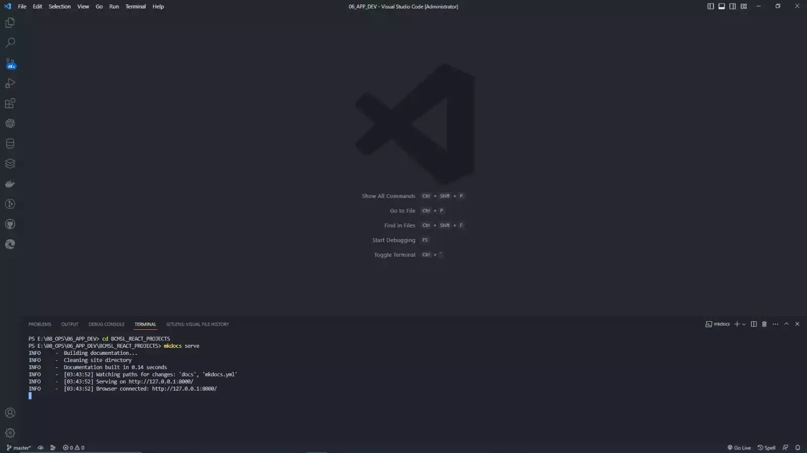
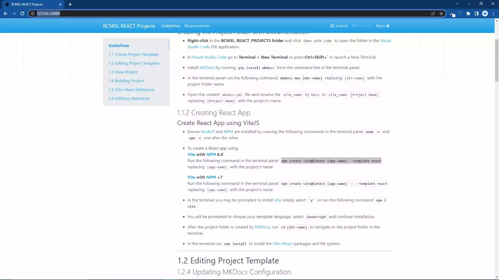
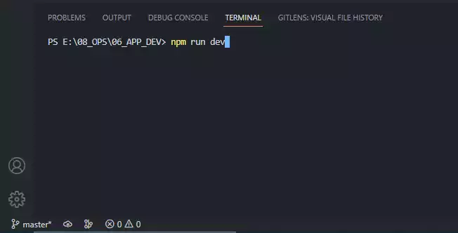
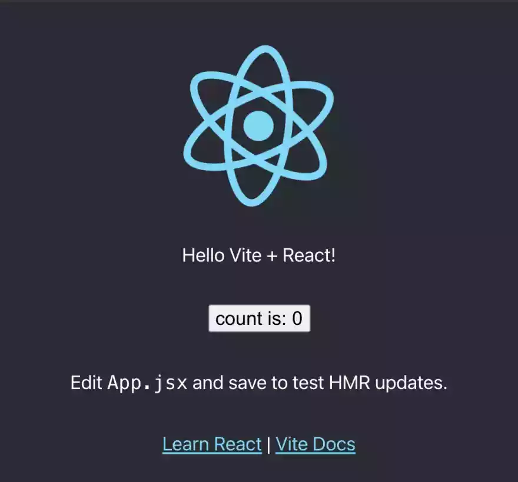

# 4. View Project

## 4.1 Serving the Documentation

### **Viewing the documentation in the Web Browser**

* **4.1.1** - After the project folder is created by [MkDocs](https://www.mkdocs.org/getting-started/#theming-our-documentation), run **`cd [dir-name]`** to navigate to the project folder in the :material-powershell: PowerShell Terminal.

* **4.1.2** - In the :material-powershell: PowerShell Terminal run **`mkdocs serve`** to start the live-reloading docs server, it should launch at [http://127.0.0.1:8000/](http://localhost:8000/) or [http://localhost:8000/](http://localhost:8000/).  
{ width="600" title="click to enlarge"}

* **4.1.3** - Open any web browser, preferably [Google Chrome](https://www.google.com/chrome/) or [Mozilla Firefox](https://www.mozilla.org/en-US/firefox/new/) and navigate to either [http://127.0.0.1:8000/](http://localhost:8000/) or [http://localhost:8000/](http://localhost:8000/) via the URL.  
{ width="600" title="click to enlarge"}
  
## 4.2 Serving the React Project

### **Running the React Project in the Web Browser**

* **4.2.1** - When the project template installation is complete run **`npm run dev`** to start the live-reloading docs server, it should launch at [http://127.0.0.1:5173/](http://127.0.0.1:5173/) or [http://localhost:5173/](http://127.0.0.1:5173/).  
{ width="600" title="click to enlarge"}

* **4.2.2** - Open any web browser, preferably [Google Chrome](https://www.google.com/chrome/) or [Mozilla Firefox](https://www.mozilla.org/en-US/firefox/new/) and navigate to either [http://127.0.0.1:8000/](http://127.0.0.1:5173/) or [http://localhost:8000/](http://127.0.0.1:5173/) via the URL.  
{ width="600" title="click to enlarge"}

***
!!! note-license inline "License Notice"
  
    [Blue Coconut Multimedia Solutions Limited](https://bluecoconut.ltd)  
    52A Eccles Road, Grand Lagoon,  
    Mayaro, Trinidad and Tobago, W.I.  
    <info@bluecoconut.ltd>  
    --------------------------
    All Rights Reserved under the:  
    [MIT License (2023)](license.md)  
    { width="50px" } { width="50px" }
